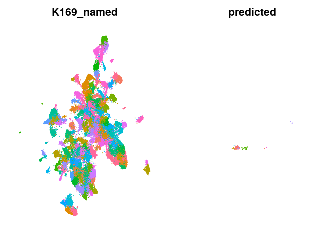
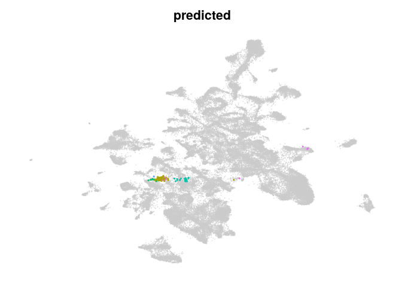

<!-- README.md is generated from README.Rmd. Please edit that file -->

# mapscvi

<!-- badges: start -->
<!-- badges: end -->

Map single cell expression data in a seurat object into reference scvi
latent space and reference umap based on seurat.

## Installation

Install mapscvi using:

``` r
devtools::install_github("lsteuernagel/mapscvi")
```

In order to use the package python and scvi &gt;= 0.8, as well as R and
Seurat &gt; 4.0.0 are required.

A docker image which comes with a compatible R, Seurat v4, pytorch and
scvi installation can be found here:
<https://hub.docker.com/r/lsteuernagel/r_scvi>

## Example

This package allows to embed new single-cell data stored in Seurat
objects into HypoMap.

The functions used to do this can also be used to embed data into other
models.

An example workflow that embeds the Romanov et al. smart-seq dataset
into the HypoMap:

``` r
library(mapscvi)
```

We can use the example data which is a Seurat object.

``` r
query_romanov
#> An object of class Seurat 
#> 21143 features across 845 samples within 1 assay 
#> Active assay: RNA (21143 features, 1500 variable features)
```

The test data does not contain any dimensional reductions for
visualization or annotation.

``` r
names(query_romanov@reductions)
#> NULL
```

#### Obtain the reference HypoMap

At the momment the reference seurat object cannot be distributed
directly as part of the package.

Load it directly (e.g. after download):

``` r
neuron_map_seurat = readRDS("/beegfs/scratch/bruening_scratch/lsteuernagel/data/hypoMap/hypoMap_objects/hypothalamus_neurons_reference.rds")
```

#### Map the data onto the HypoMap

To map data to the reference HypoMap, we use the HypoMap model and a
reduced reference seurat object with only relevant information and fewer
cell. The model will automatically be used when setting the
reference\_mode to “hypoMap\_neurons” or “hypoMap\_full” in the wrapper
function below. However we still have to provide the reference object
loaded above!

``` r
query_romanov_neurons = map_new_seurat_hypoMap(mapscvi::query_romanov,reference_mode = "hypoMap_neurons",reference_seurat = neuron_map_seurat, suffix="query_romanov_neurons",max_epochs=20)
names(query_romanov@reductions)
```

We can take a look at the top clusters that were found in the query:

``` r
head(sort(table(query_romanov_neurons@meta.data$predicted),decreasing = TRUE),n = 10)
#> 
#>           Shox2.Tbr1.Nrn1.HY2    Mobp.Sepp1.Pitx2.Foxb1.HY2 
#>                           141                            61 
#>             Trh.Sim1.Nrn1.HY2 Slc7a10.Sepp1.Pitx2.Foxb1.HY2 
#>                            53                            49 
#>                     Smim3.Oxt        Th.Prok2.Hmx3.Hmx2.HY1 
#>                            45                            26 
#>      Crh.Pou3f3.Sim1.Nrn1.HY2       Fbxw13.Sp9.Gad2.Arx.HY1 
#>                            23                            22 
#>                  Sst.Nrn1.HY2             Sncg.Gad2.Arx.HY1 
#>                            20                            18
```

The package provides plotting functions to visualize the query cells on
the reference:

We can plot query and reference side by side. Here we set labelonplot to
False to prevent cluster labels from being plotted and we use the object
‘reference\_hypoMap\_full’ that is automatically loaded when using the
wrapper above.

``` r
plot_query_labels(query_seura_object=query_romanov_neurons,reference_seurat=neuron_map_seurat,label_col="K169_named",overlay = FALSE,labelonplot = FALSE)
```


Overlay them query over the reference. The overlay parameters allow to
change the behavior of query points. We can use the Seurat::DimPlot
parameters to further adjust the plots. E.g. by decreasing the size of
the labels.

``` r
plot_query_labels(query_seura_object=query_romanov_neurons,reference_seurat=neuron_map_seurat,label_col="K169_named",overlay = TRUE,query_pt_size = 0.4,labelonplot = FALSE,label.size=1)
#> Scale for 'colour' is already present. Adding another scale for 'colour',
#> which will replace the existing scale.
```


## Detailed walkthrough

This section contains a more detailed walkthrough of the functions that
are executed when calling ‘map\_new\_seurat\_hypoMap’.

For this we will embed the mouse LaMannoBrainData stored in a
SingleCellExperiment (available via the scRNAseq package) in the
HypoMap.

``` r
sce_lamanno_da
```

The prepare\_query function is able to load Seurat, SingleCellExperiment
or matrix objects for mapping.

Here we are using the prepare\_query\_hypoMap that extends the more
generic prepare\_query function with code to to automatically add
metadata variables that are required for mapping to the HypoMap model.
The function can also normalize the data, however for the scvi mapping
raw counts are required!

``` r
lamanno_seurat_object = prepare_query_hypoMap(sce_lamanno_da,suffix="lamanno_da",normalize=TRUE)
lamanno_seurat_object
#> An object of class Seurat 
#> 18219 features across 243 samples within 1 assay 
#> Active assay: RNA (18219 features, 0 variable features)
```

This new seurat object is compatible with the downstream functions for
mapping the data.

Next predict\_query can be used to embed the query data into the latent
space of scvi. We have to specify a model path and the number of epochs
for training during mapping (10-20 should be sufficient. TODO: test
this!).

``` r
model_path = paste0(system.file('extdata/models/hypothalamus_neurons_reference_model', package = 'mapscvi'),"/")
max_epochs = 20
lamanno_seurat_object = predict_query(lamanno_seurat_object,model_path,max_epochs = max_epochs)
```

``` r
names(lamanno_seurat_object@reductions)
#> [1] "scvi"
```

The scvi reduction is a pca-like low dimensional space that can be used
to embed the data into the same UMAP as the reference object. This
requires an existing UMAP model in the reference Seurat object that was
calculated based on the same scvi latent space.

We use the neuron\_map\_seurat object loaded in the first section!

Then we can calculate nearest neighbors and UMAP based on the reference.
Additionally we can project labels (any categorical metadata column from
the reference) using the same nearest neighbor graph. This helps with
consistency between label propagation and UMAP. However there might be
more accurate ways to propagate labels using other classifiers such as a
random forest or scANVI.

To propagate labels with the project\_query function we can provide a
vector of the same length as the reference cells (and same order!).
Preferably this is a column from the metadata of the reference seurat
object.

``` r
cluster_labels = neuron_map_seurat@meta.data$K169_named
reference_reduction = "scvi"
lamanno_seurat_object = project_query(query_seurat_object = lamanno_seurat_object,
                                      reference_map_reduc = neuron_map_seurat@reductions[[reference_reduction]],
                                      reference_map_umap = neuron_map_seurat@reductions[[paste0("umap_",reference_reduction)]],
                                      query_reduction = "scvi",
                                      label_vec =cluster_labels)
#> 2021-11-02 17:26:55: Project UMAP..
#> Computing nearest neighbors
#> Warning: The following arguments are not used: seed_use, return.neighbor
#> Running UMAP projection
#> 17:27:18 Read 243 rows
#> 17:27:18 Processing block 1 of 1
#> 17:27:18 Commencing smooth kNN distance calibration using 1 thread
#> 17:27:18 Initializing by weighted average of neighbor coordinates using 1 thread
#> 17:27:18 Commencing optimization for 67 epochs, with 7290 positive edges
#> 17:27:18 Finished
#> Warning: No assay specified, setting assay as RNA by default.
#> 2021-11-02 17:27:18: Add results to Seurat..
#> Warning: Keys should be one or more alphanumeric characters followed by an
#> underscore, setting key from umap_scvi to umapscvi_
#> Warning: All keys should be one or more alphanumeric characters followed by an
#> underscore '_', setting key to umapscvi_
#> 2021-11-02 17:27:18: Predict labels...
#> Estimate probabilities
#> Estimate entropy
#> Found query_ref_nn
#> Calculating average distances ...
```

This can then be used to plot the results side-by side:

``` r
plot_query_labels(query_seura_object=lamanno_seurat_object,reference_seurat=neuron_map_seurat,label_col="K169_named",overlay = FALSE,labelonplot = FALSE)
```



Or with overlay:

``` r
plot_query_labels(query_seura_object=lamanno_seurat_object,reference_seurat=neuron_map_seurat,label_col="K169_named",overlay = TRUE,query_pt_size = 0.4,labelonplot = FALSE,label.size=1)
#> Scale for 'colour' is already present. Adding another scale for 'colour',
#> which will replace the existing scale.
```


This obviously didn’t work out very well.

Most cells were mapped to the same celltype in the middle of the UMAP,
which is likely a result of missing ‘true’ neighbors:

``` r
head(sort(table(lamanno_seurat_object@meta.data$predicted),decreasing = TRUE),n = 10)
#> 
#>         Ebf3.Tbr1.Nrn1.HY2 Mobp.Sepp1.Pitx2.Foxb1.HY2 
#>                        182                         26 
#>   Slc6a3.Fam159b.Satb2.HY1   Irx3.Pitx2.Tbr1.Nrn1.HY2 
#>                         24                          8 
#>          Ngfr.Lhx6.Arx.HY1         Prph.Lef1.Hmx2.HY1 
#>                          1                          1 
#>          Sncg.Gad2.Arx.HY1 
#>                          1
```

TODO: Add some indicators for quality of mapping.
