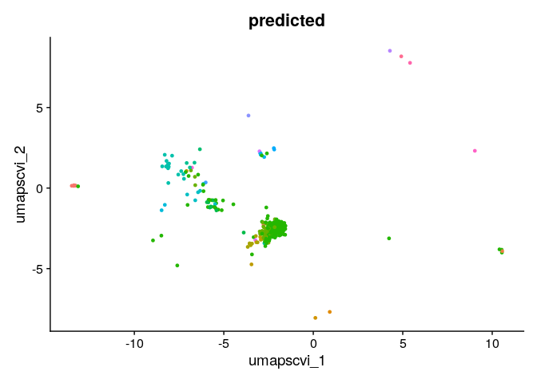

<!-- README.md is generated from README.Rmd. Please edit that file -->

# mapscvi

<!-- badges: start -->
<!-- badges: end -->

Map single cell expression data in a seurat object into reference scvi
latent space and reference umap based on seurat.

## Installation

Install mapscvi using:

``` r
devtools::install_github("lsteuernagel/mapscvi")
```

In order to use the package python and scvi &gt;= 0.8, as well as R and
Seurat &gt; 4.0.0 are required.

A docker image which comes with a compatible R, Seurat v4, pytorch and
scvi installation can be found here:
<https://hub.docker.com/r/lsteuernagel/r_scvi>

## Example

This package allows to embed new single-cell data stored in Seurat
objects into HypoMap.

The functions used to do this can also be used to embed data into other
models.

An example workflow that emebds the romanov et al. smart-seq dataset
into the HypoMap:

``` r
library(mapscvi)
#> Registered S3 method overwritten by 'cli':
#>   method     from    
#>   print.boxx spatstat
#> Registered S3 method overwritten by 'SeuratDisk':
#>   method            from  
#>   as.sparse.H5Group Seurat

#You'll still need to render `README.Rmd` regularly, to keep `README.md` up-to-date. `devtools::build_readme()` is handy for this. You could also use GitHub Actions to re-render `README.Rmd` every time you push. An example workflow can be found here: <https://github.com/r-lib/actions/tree/master/examples>.
```

We load the example data which contains a Seurat object.

``` r
load("/beegfs/scratch/bruening_scratch/lsteuernagel/data/tmp_mapscvi/query_test_object.RData")
query_seurat_object
#> An object of class Seurat 
#> 21143 features across 845 samples within 1 assay 
#> Active assay: RNA (21143 features, 1500 variable features)
```

The test data does not contain any dimensional reductions for
visualization or annotation.

``` r
names(query_seurat_object@reductions)
#> NULL
```

This wrapper function executes all required mapping steps. We provide
the query object as well as a column from HypoMap which we want to
predict.

``` r
head(sort(table(query_seurat_object@meta.data$predicted),decreasing = TRUE),n = 20)
#> 
#>           Slc17a6.Nrn1.Tbr1.Shox2    Slc17a6.Foxb1.Pitx2.Sepp1.Mobp 
#>                               141                                61 
#>             Slc17a6.Nrn1.Sim1.Trh Slc17a6.Foxb1.Pitx2.Sepp1.Slc7a10 
#>                                53                                49 
#>                         Oxt.Smim3        Slc32a1.Hmx2.Hmx3.Prok2.Th 
#>                                45                                25 
#>        Slc17a6.Nrn1.Sim1.Ebf3.Crh       Slc32a1.Arx.Gad2.Sp9.Fbxw13 
#>                                23                                22 
#>                  Slc17a6.Nrn1.Sst             Slc32a1.Arx.Gad2.Sncg 
#>                                20                                18 
#>                          Oxt.Ebf3        Slc17a6.Nrn1.Sim1.Ebf1.Otp 
#>                                15                                14 
#>          Slc32a1.Arx.St18.Tmem215             Slc32a1.Hmx2.Hmx3.Nts 
#>                                14                                14 
#>      Slc32a1.Hmx2.Hmx3.Pmaip1.Gal   Slc17a6.Fezf1.Cd40.Nr5a1.Gpr149 
#>                                14                                13 
#>    Slc32a1.Arx.Gad2.Meis2.Slc30a3    Slc32a1.Tbx3.Tcf7l2.Pomc.Anxa2 
#>                                11                                11 
#>   Slc32a1.Arx.Gad2.Onecut2.Adarb2       Slc32a1.Hmx2.Hmx3.Prok2.Nts 
#>                                10                                10
```

``` r
Seurat::DimPlot(query_seurat_object,group.by = "predicted")+Seurat::NoLegend()
```



## Preparing a Seurat object

TODO: Showcase helper function and provide a guide on how to get to a
Seurat object with the right format.

## Detailed walkthrough

TODO: Explain all individual setup
