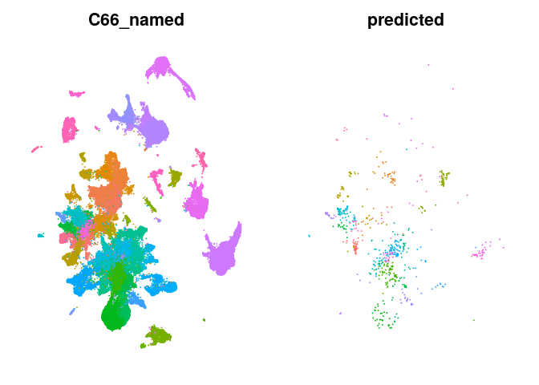
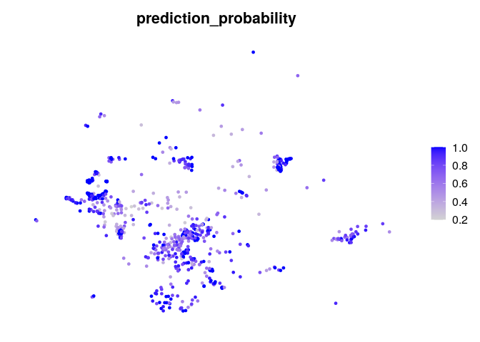

<!-- README.md is generated from README.Rmd. Please edit that file -->

# mapscvi

<!-- badges: start -->
<!-- badges: end -->

Map single cell expression data in a seurat object into reference scvi
latent space and reference umap based on seurat.

## Installation

Install mapscvi using:

``` r
devtools::install_github("lsteuernagel/mapscvi")
```

In order to use the package python and scvi &gt;= 0.8, as well as R and
Seurat &gt; 4.0.0 are required.

A docker image which comes with a compatible R, Seurat v4, pytorch and
scvi installation can be found here:
<https://hub.docker.com/r/lsteuernagel/r_scvi>

## Example

This package allows to embed new single-cell data stored in Seurat
objects into HypoMap.

The functions used to do this can also be used to embed data into other
models.

An example workflow that embeds the Romanov et al. smart-seq dataset
into the HypoMap:

``` r
library(mapscvi)
library(Seurat)
```

We can use the example data which is a Seurat object.

``` r
query_romanov
#> An object of class Seurat 
#> 21143 features across 845 samples within 1 assay 
#> Active assay: RNA (21143 features, 1500 variable features)
```

The test data does not contain any dimensional reductions for
visualization or annotation.

``` r
names(query_romanov@reductions)
#> NULL
```

#### Map the data onto the HypoMap

To map data to the reference HypoMap, we use the HypoMap model and a
reduced reference seurat object with only relevant information and fewer
cell. The model and reference seurat for neighbor search and umap
construction will automatically be used when setting the reference\_mode
to “hypoMap\_neurons” or “hypoMap\_full” in the wrapper function below.

``` r
query_romanov_neurons = mapscvi::map_new_seurat_hypoMap(mapscvi::query_romanov,reference_mode = "hypoMap_neurons", suffix="query_romanov_neurons",max_epochs=20)
```

After successful mapping the objects contains the scvi and umap
reductions:

``` r
names(query_romanov_neurons@reductions)
#> [1] "scvi"      "umap_scvi"
```

#### Plotting results:

We can take a look at the top clusters that were found in the query:

``` r
head(sort(table(query_romanov_neurons@meta.data$predicted),decreasing = TRUE),n = 10)
#> 
#>           Shox2.Tbr1.Nrn1.HY2    Mobp.Sepp1.Pitx2.Foxb1.HY2 
#>                           141                            60 
#>             Trh.Sim1.Nrn1.HY2 Slc7a10.Sepp1.Pitx2.Foxb1.HY2 
#>                            53                            48 
#>                     Smim3.Oxt      Crh.Pou3f3.Sim1.Nrn1.HY2 
#>                            46                            25 
#>        Th.Prok2.Hmx3.Hmx2.HY1       Fbxw13.Sp9.Gad2.Arx.HY1 
#>                            25                            22 
#>                  Sst.Nrn1.HY2             Sncg.Gad2.Arx.HY1 
#>                            20                            18
```

The package provides plotting functions to visualize the query cells on
the reference:

We can plot query and reference side by side. Here we set labelonplot to
False to prevent cluster labels from being plotted and we use the object
‘reference\_hypoMap\_full’ that is automatically loaded when using the
wrapper above.

``` r
plot_query_labels(query_seura_object=query_romanov_neurons,reference_seurat=mapscvi::reference_hypoMap_neurons,label_col="K169_named",overlay = FALSE,labelonplot = FALSE)
```



Overlay them query over the reference. The overlay parameters allow to
change the behavior of query points. We can use the Seurat::DimPlot
parameters to further adjust the plots. E.g. by decreasing the size of
the labels.

``` r
plot_query_labels(query_seura_object=query_romanov_neurons,reference_seurat=mapscvi::reference_hypoMap_neurons,label_col="K169_named",overlay = TRUE,query_pt_size = 0.4,labelonplot = FALSE,label.size=1)
#> Scale for 'colour' is already present. Adding another scale for 'colour',
#> which will replace the existing scale.
```

 The
mapping also returns a prediction probability based on the similarity to
the the neighbors in there reference which an indicate how well
different cells mapped to their assigned celltypes.

``` r
Seurat::FeaturePlot(query_romanov_neurons,features = "prediction_probability")+Seurat::NoAxes()
```



## Note on subsetting and full HypoMap

While here we started directly by embedding data onto the neruon map
typical worflow would start by embedding data first onto the full map
with all celltypes and then afterwards only take the predicted neurons
to map onto the reference map

``` r
# mapscvi::query_romanov was already subset to neurons which is why this step does not make much sense for this example data
query_romanov_full = mapscvi::map_new_seurat_hypoMap(mapscvi::query_romanov,reference_mode = "hypoMap_full",label_col = "Curated_Class", suffix="query_romanov_full",max_epochs=20)
query_romanov_full@meta.data$predicted_class = query_romanov_full@meta.data$predicted
```

``` r
# similar to example above
query_romanov_neurons = mapscvi::map_new_seurat_hypoMap(query_romanov_full, reference_mode = "hypoMap_neurons", suffix="query_romanov_neurons",max_epochs=20,subset_col = "predicted_class", subset_values = "Neurons")
names(query_romanov_neurons@reductions)
```

## Detailed walkthrough

This section contains a more detailed walkthrough of the functions that
are executed when calling ‘map\_new\_seurat\_hypoMap’.

For this we will embed the mouse LaMannoBrainData stored in a
SingleCellExperiment (available via the scRNAseq package) in the
HypoMap.

``` r
sce_lamanno_da
```

The prepare\_query function is able to load Seurat, SingleCellExperiment
or matrix objects for mapping.

Here we are using the prepare\_query\_hypoMap that extends the more
generic prepare\_query function with code to to automatically add
metadata variables that are required for mapping to the HypoMap model.
The function can also normalize the data, however for the scvi mapping
raw counts are required!

``` r
lamanno_seurat_object = prepare_query_hypoMap(sce_lamanno_da,suffix="lamanno_da",normalize=TRUE)
lamanno_seurat_object
#> An object of class Seurat 
#> 18219 features across 243 samples within 1 assay 
#> Active assay: RNA (18219 features, 0 variable features)
```

This new seurat object is compatible with the downstream functions for
mapping the data.

Next, predict\_query can be used to embed the query data into the latent
space of scvi. We have to specify a model path and the number of epochs
for training during mapping (10-20 should be sufficient.).

The mapscvi package comes with two models for the neuron and full
hypothalamus map in the extdata which can be found using system.file as
below.

``` r
model_path = paste0(system.file('extdata/models/hypothalamus_neurons_reference_model', package = 'mapscvi'),"/")
max_epochs = 20
lamanno_seurat_object = predict_query(lamanno_seurat_object,model_path,max_epochs = max_epochs)
```

``` r
names(lamanno_seurat_object@reductions)
#> [1] "scvi"
```

The scvi reduction is a pca-like low dimensional space that can be used
to embed the data into the same UMAP as the reference object. This
requires an existing UMAP model in the reference Seurat object that was
calculated based on the same scvi latent space.

We use the mapscvi::reference\_hypoMap\_neurons object that comes with
the package and contains for each cell the scvi and umap reduction
values as well as metadata.

``` r
mapscvi::reference_hypoMap_neurons
#> An object of class Seurat 
#> 28266 features across 85451 samples within 1 assay 
#> Active assay: RNA (28266 features, 0 variable features)
#>  2 dimensional reductions calculated: scvi, umap_scvi
```

Then we can calculate nearest neighbors and UMAP based on the reference.
Additionally we can project labels (any categorical metadata column from
the reference) using the same nearest neighbor graph. This helps with
consistency between label propagation and UMAP. However there might be
more accurate ways to propagate labels using other classifiers such as a
random forest or scANVI.

To propagate labels with the project\_query function we can provide a
vector of the same length as the reference cells (and same order!).
Preferably this is a column from the metadata of the reference seurat
object.

``` r
cluster_labels = mapscvi::reference_hypoMap_neurons@meta.data$K169_named
reference_reduction = "scvi"
lamanno_seurat_object = project_query(query_seurat_object = lamanno_seurat_object,
                                      reference_map_reduc = mapscvi::reference_hypoMap_neurons@reductions[[reference_reduction]],
                                      reference_map_umap = mapscvi::reference_hypoMap_neurons@reductions[[paste0("umap_",reference_reduction)]],
                                      query_reduction = "scvi",
                                      label_vec =cluster_labels)
```

This can then be used to plot the results side-by side:

``` r
plot_query_labels(query_seura_object=lamanno_seurat_object,reference_seurat=mapscvi::reference_hypoMap_neurons,label_col="K169_named",overlay = FALSE,labelonplot = FALSE)
```


Or with overlay:

``` r
plot_query_labels(query_seura_object=lamanno_seurat_object,reference_seurat=mapscvi::reference_hypoMap_neurons,label_col="K169_named",overlay = TRUE,query_pt_size = 0.4,labelonplot = FALSE,label.size=1)
#> Scale for 'colour' is already present. Adding another scale for 'colour',
#> which will replace the existing scale.
```


This obviously didn’t work out very well.

Most cells were mapped to the same celltype in the middle of the UMAP,
which is likely a result of missing ‘true’ neighbors:

``` r
head(sort(table(lamanno_seurat_object@meta.data$predicted),decreasing = TRUE),n = 10)
#> 
#>         Ebf3.Tbr1.Nrn1.HY2 Mobp.Sepp1.Pitx2.Foxb1.HY2 
#>                        203                         25 
#>   Slc6a3.Fam159b.Satb2.HY1   Irx3.Pitx2.Tbr1.Nrn1.HY2 
#>                          7                          6 
#>         Prph.Lef1.Hmx2.HY1          Sncg.Gad2.Arx.HY1 
#>                          1                          1
```

This is not very suprising because the datasets does not contain
hypothalamic neurons, while the nearest neighbor algorithm will still
try to find neighbors in the reference.

#### Quality of mapping results:

We can use various quality metrics to see how the projection of the new
data worked.

The prediction\_probability is mostly helpful in determining whether a
celltype was unambiguously mapped.

``` r
Seurat::FeaturePlot(lamanno_seurat_object,features = "prediction_probability")+Seurat::NoAxes()
```


We can see that the left blob (mostly neurons) has relatively low
quality, probably due to the fact that they have mixed celltypes as
their neighbors. Some cells score high, sees are probably non-neurons
that mapped to the ‘Mobp.Sepp1.Pitx2.Foxb1.HY2’ astrocyte/junk cluster.

Additionally there seems to be a handful of ‘Slc6a3.Fam159b.Satb2.HY1’
that might correspond to the actual hypothalamus cells.

Another way to look at mapping quality is to estimate the expression of
marker genes of the assigned celltypes.

For this we need a list of marker genes for each cluster. The
mapscvi::reference\_hypoMap\_neurons provides such a list for the
‘markers\_K169\_pruned’ level:

``` r
marker_genes_K169_pruned = mapscvi::reference_hypoMap_neurons@misc$markers_K169_pruned
head(sapply(marker_genes_K169_pruned,length))
#>   K169-1  K169-10 K169-100 K169-101 K169-102 K169-103 
#>      542      106      441      127      216      181
```

Since we predicted the K169\_named column but the markers use the
corresponding identifiers in K169\_pruned we need to add these to the
lamanno\_seurat\_object.

One way to do this would be to rerun the projection step and specify a
different column. An easier and faster way is to use the add
add\_paired\_annotation() function to propagate other labels that are
part of the ‘reference\_hypoMap\_neurons’ meta.data.

The ‘predicted’ column contains the output from the project\_query()
function. For clarity we add another column with a clearer name and then
use the add\_paired\_annotation() to obtain a vector containing the
corresponding K169\_pruned values:

``` r
lamanno_seurat_object@meta.data$predicted_K169_named = lamanno_seurat_object@meta.data$predicted
pruned_values = mapscvi::add_paired_annotation(input_annotation = lamanno_seurat_object@meta.data$predicted_K169_named,
                               reference_annotations = mapscvi::reference_hypoMap_neurons@meta.data[,c("K169_named","K169_pruned")])
head(pruned_values)
#> [1] "K169-127" "K169-69"  "K169-127" "K169-127" "K169-127" "K169-127"
```

We can then add these as a metadata column and specify them as the
column to use in the check\_reference\_markers\_per\_cell() function

``` r
lamanno_seurat_object@meta.data$predicted_K169_pruned = pruned_values
lamanno_seurat_object = check_reference_markers_per_cell(lamanno_seurat_object,marker_genes_K169_pruned,assay="RNA",query_label_col="predicted_K169_pruned",min_expr=0)
#> Adding result to metadata as: marker_pct
```

The result is the percentage of marker genes expressed which we can
visualize on the umap:

``` r
Seurat::FeaturePlot(lamanno_seurat_object,features = "marker_pct")+Seurat::NoAxes()
```


This confirms the observations from the neighbor based
prediction\_probability. The outlier cells from the
‘Slc6a3.Fam159b.Satb2.HY1’ cluster have a very low percentage of
expressed markers, suggesting that we should not trust this assignment.

## Conclusion

This vignette demonstrated the use of the mapscvi package on two example
datasets to embed unannotated single cell data in the hypothalamus
reference map. Based on the detailed walkthrough section it is also
possible to adapt the package for custom models and objects.
