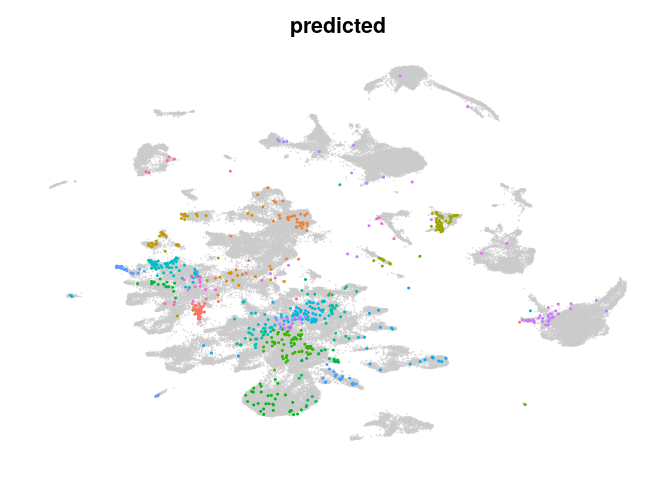
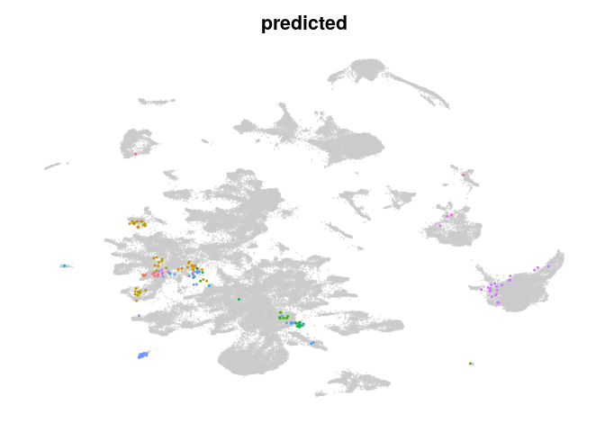
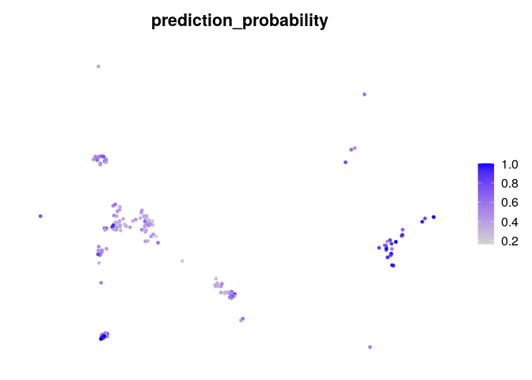

<!-- README.md is generated from README.Rmd. Please edit that file -->

# mapscvi

<!-- badges: start -->
<!-- badges: end -->

Map single cell expression data in a seurat object into reference scvi
latent space and reference umap based on seurat.

## Installation

Install mapscvi using:

``` r
if (!require("remotes", quietly = TRUE))
    install.packages("remotes")
remotes::install_github("lsteuernagel/mapscvi")
```

In order to use the package python and scvi \>= 0.8, as well as R and
Seurat \> 4.0.0 are required.

A docker image which comes with a compatible R, Seurat v4, pytorch and
scvi installation can be found here:
<https://hub.docker.com/r/lsteuernagel/r_scvi_v2/tags>

## Example

This package allows to embed new single-cell data stored in Seurat
objects into HypoMap.

The functions used to do this can also be used to embed data into other
models.

An example workflow that embeds the Romanov et al. smart-seq dataset
into the HypoMap:

``` r
library(mapscvi)
library(Seurat)
```

We can use the example data which is a Seurat object.

``` r
query_romanov
#> An object of class Seurat 
#> 21143 features across 845 samples within 1 assay 
#> Active assay: RNA (21143 features, 1500 variable features)
```

The test data does not contain any dimensional reductions for
visualization or annotation.

``` r
names(query_romanov@reductions)
#> NULL
```

#### Map the data onto the HypoMap

To map data to the reference HypoMap, we use the HypoMap model and a
reduced reference seurat object with only relevant information and fewer
cell. The model and reference seurat for neighbor search and umap
construction will automatically be used when setting the reference_mode
to “hypoMap_neurons” or “hypoMap_full” in the wrapper function below.

``` r
query_romanov = mapscvi::map_new_seurat_hypoMap(mapscvi::query_romanov,suffix="query_romanov",label_col = "C66_named",max_epochs=20)
```

After successful mapping the objects contains the scvi and umap
reductions:

``` r
names(query_romanov@reductions)
#> [1] "scvi"      "umap_scvi"
```

#### Plotting results:

We can take a look at the top clusters that were found in the query:

``` r
head(sort(table(query_romanov@meta.data$predicted),decreasing = TRUE),n = 10)
#> 
#>                  C66-1: GLU-1          C66-28: Mixed.GABA-2 
#>                           138                            79 
#>              C66-4: Trh.GLU-2         C66-22: Caprin2.GLU-6 
#>                            69                            63 
#>            C66-43: Nts.GABA-1 C66-55: Ermn.Oligodendrocytes 
#>                            60                            38 
#>          C66-29: Vipr2.GABA-2          C66-12: Gpr149.GLU-3 
#>                            33                            29 
#>            C66-18: Rfx4.GLU-4           C66-5: Tent5a.GLU-2 
#>                            29                            26
```

The package provides plotting functions to visualize the query cells on
the reference:

We can plot query and reference side by side. Here we set labelonplot to
False to prevent cluster labels from being plotted and we use the object
‘reference_hypoMap_full’ that is automatically loaded when using the
wrapper above.

``` r
plot_query_labels(query_seura_object=query_romanov,reference_seurat=mapscvi::reference_hypoMap_downsample,label_col="C66_named",overlay = FALSE,labelonplot = FALSE)
```


Overlay them query over the reference. The overlay parameters allow to
change the behavior of query points. We can use the Seurat::DimPlot
parameters to further adjust the plots. E.g. by decreasing the size of
the labels.

``` r
plot_query_labels(query_seura_object=query_romanov,reference_seurat=mapscvi::reference_hypoMap_downsample,label_col="C66_named",overlay = TRUE,query_pt_size = 0.4,labelonplot = FALSE,label.size=1)
#> Scale for 'colour' is already present. Adding another scale for 'colour',
#> which will replace the existing scale.
```



The mapping also returns a prediction probability based on the
similarity to the the neighbors in there reference which an indicate how
well different cells mapped to their assigned celltypes.

``` r
Seurat::FeaturePlot(query_romanov,features = "prediction_probability")+Seurat::NoAxes()
```


## Detailed walkthrough

This section contains a more detailed walkthrough of the functions that
are executed when calling ‘map_new_seurat_hypoMap’.

For this we will embed the mouse LaMannoBrainData (available via the
scRNAseq package) in the HypoMap.

``` r
lamanno_seurat
```

The prepare_query function is able to load Seurat, SingleCellExperiment
or matrix objects for mapping.

``` r
lamanno_seurat_object = prepare_query(lamanno_seurat,suffix="lamanno_da",normalize=TRUE)
```

This new seurat object is compatible with the downstream functions for
mapping the data.

Next, predict_query can be used to embed the query data into the latent
space of scvi. We have to specify a model path and the number of epochs
for training during mapping (10-20 should be sufficient.).

The mapscvi package comes with two models for the neuron and full
hypothalamus map in the extdata which can be found using system.file as
below.

``` r
model_path = paste0(system.file('extdata/models/hypoMap_harmonized_scVI_model/"', package = 'mapscvi'),"/")
max_epochs = 20
lamanno_seurat_object = predict_query(lamanno_seurat_object,model_path = system.file("extdata/models/hypoMap_harmonized_scVI_model/", package = 'mapscvi'),max_epochs = max_epochs)
```

``` r
names(lamanno_seurat_object@reductions)
#> [1] "scvi"
```

The scvi reduction is a pca-like low dimensional space that can be used
to embed the data into the same UMAP as the reference object. This
requires an existing UMAP model in the reference Seurat object that was
calculated based on the same scvi latent space.

We use the mapscvi::reference_hypoMap_downsample object that comes with
the package and contains for each cell the scvi and umap reduction
values as well as metadata.

``` r
mapscvi::reference_hypoMap_downsample
#> An object of class Seurat 
#> 57362 features across 104925 samples within 1 assay 
#> Active assay: RNA (57362 features, 0 variable features)
#>  2 dimensional reductions calculated: scvi, umap_scvi
```

Then we can calculate nearest neighbors and UMAP based on the reference.
Additionally we can project labels (any categorical metadata column from
the reference) using the same nearest neighbor graph. This helps with
consistency between label propagation and UMAP. However there might be
more accurate ways to propagate labels using other classifiers such as a
random forest or scANVI.

To propagate labels with the project_query function we can provide a
vector of the same length as the reference cells (and same order!).
Preferably this is a column from the metadata of the reference seurat
object.

``` r
cluster_labels = mapscvi::reference_hypoMap_downsample@meta.data$C66_named
reference_reduction = "scvi"
lamanno_seurat_object = project_query(query_seurat_object = lamanno_seurat_object,
                                      reference_map_reduc = mapscvi::reference_hypoMap_downsample@reductions[[reference_reduction]],
                                      reference_map_umap = mapscvi::reference_hypoMap_downsample@reductions[[paste0("umap_",reference_reduction)]],
                                      query_reduction = "scvi",
                                      label_vec =cluster_labels)
```

This can then be used to plot the results side-by side:

``` r
plot_query_labels(query_seura_object=lamanno_seurat_object,reference_seurat=mapscvi::reference_hypoMap_downsample,label_col="C66_named",overlay = FALSE,labelonplot = FALSE)
```


Or with overlay:

``` r
plot_query_labels(query_seura_object=lamanno_seurat_object,reference_seurat=mapscvi::reference_hypoMap_downsample,label_col="C66_named",overlay = TRUE,query_pt_size = 0.4,labelonplot = FALSE,label.size=1)
#> Scale for 'colour' is already present. Adding another scale for 'colour',
#> which will replace the existing scale.
```


This obviously didn’t work out very well.

Most cells were mapped to the same celltype in the middle of the UMAP,
which is likely a result of missing ‘true’ neighbors:

``` r
head(sort(table(lamanno_seurat_object@meta.data$predicted),decreasing = TRUE),n = 10)
#> 
#>           C66-50: Chat.GABA-7            C66-18: Rfx4.GLU-4 
#>                           122                            33 
#> C66-55: Ermn.Oligodendrocytes        C66-30: Onecut2.GABA-2 
#>                            23                            13 
#>            C66-8: Lmx1a.GLU-2         C66-15: Adcyap1.GLU-3 
#>                            11                            10 
#>             C66-2: Irx5.GLU-2          C66-28: Mixed.GABA-2 
#>                             9                             7 
#>          C66-49: Satb2.GABA-6           C66-42: Lhx8.GABA-1 
#>                             5                             3
```

This is not very suprising because the datasets does not contain
hypothalamic neurons, while the nearest neighbor algorithm will still
try to find neighbors in the reference. Cholinergic neurons are moved to
the hypothalamic cholinergic neurons.

#### Quality of mapping results:

We can use various quality metrics to see how the projection of the new
data worked.

The prediction_probability is mostly helpful in determining whether a
celltype was unambiguously mapped.

``` r
Seurat::FeaturePlot(lamanno_seurat_object,features = "prediction_probability")+Seurat::NoAxes()
```



## Conclusion

This vignette demonstrated the use of the mapscvi package on two example
datasets to embed unannotated single cell data in the hypothalamus
reference map. Based on the detailed walkthrough section it is also
possible to adapt the package for custom models and objects.
